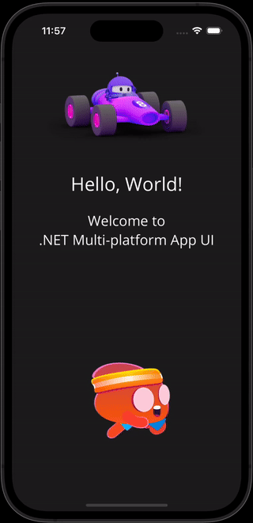
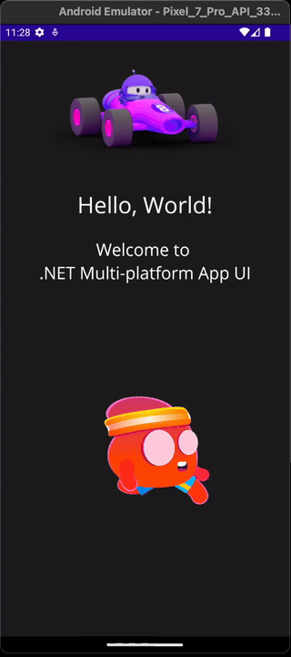
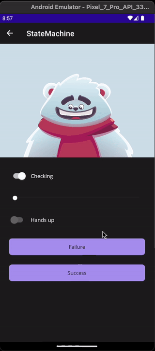

# Rive Maui

Wrapper around the iOS/Android runtime

_(Work in progress)_

 
<br>
<br>
 


## Getting started
- Call .UseRive() on MauiAppBuilder in MauiProgram.cs
- Set iOS target version in .csproj to at least 14:

```<SupportedOSPlatformVersion Condition="$([MSBuild]::GetTargetPlatformIdentifier('$(TargetFramework)')) == 'ios'">14.0</SupportedOSPlatformVersion>```

- Add .riv files to Resources/Images