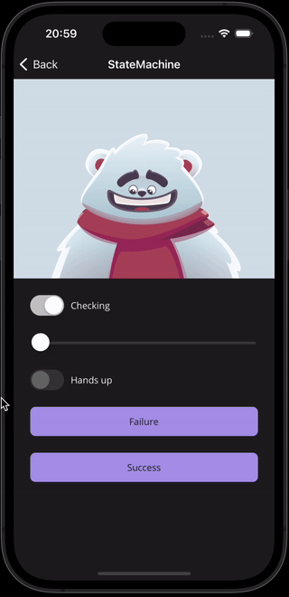

# Rive Maui

Wrapper around the iOS/Android runtime

_(Work in progress)_

 
 
 

## Getting started
- Install Rive.Maui nuget
- Call .UseRive() on MauiAppBuilder in MauiProgram.cs
- Set iOS target version to at least 14 `<SupportedOSPlatformVersion Condition="$([MSBuild]::GetTargetPlatformIdentifier('$(TargetFramework)')) == 'ios'">14.0</SupportedOSPlatformVersion>`
- Add .riv files to Resources/Images